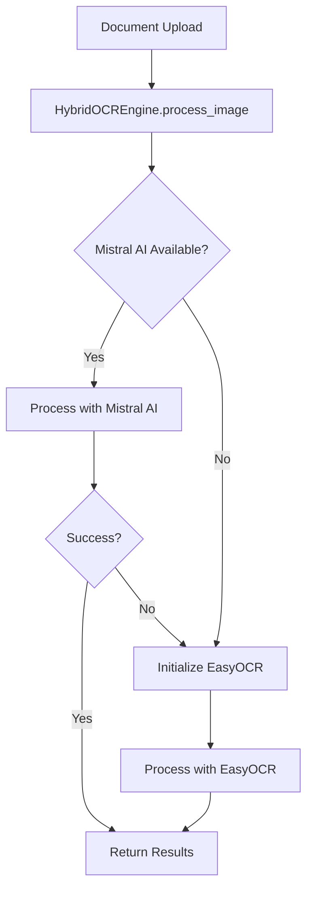

# OCR Claim Assessment System

## Project Overview
AI-powered document processing system for insurance claims using advanced OCR and natural language processing. Features memory-optimized hybrid OCR engine with Mistral AI as primary processor and EasyOCR as intelligent fallback.

## Key Commands
- `python -m pytest` - Run tests (if test framework is added)
- `gunicorn app:app` - Start production server
- `python app.py` - Development server

## Dependencies & Architecture

### Critical Dependencies
- **mistralai>=1.0.0** - Primary OCR engine (API-based, no local memory)
- **supabase>=2.0.0** - Database and authentication (resolved httpx conflict)
- **easyocr==1.7.0** - Fallback OCR engine (lazy-loaded to save memory)
- **flask==3.0.0** - Web framework
- **gunicorn==21.2.0** - Production WSGI server

### System Architecture
```
┌─────────────────┐    ┌──────────────────┐    ┌─────────────────┐
│   Flask Web     │────│  HybridOCREngine │────│   Supabase DB   │
│   Application   │    │                  │    │   (PostgreSQL)  │
└─────────────────┘    └──────────────────┘    └─────────────────┘
                              │
                    ┌─────────┴─────────┐
                    │                   │
            ┌───────▼────────┐  ┌───────▼────────┐
            │  Mistral AI    │  │    EasyOCR     │
            │   (Primary)    │  │  (Lazy Load)   │
            │   API-based    │  │  Local Models  │
            └────────────────┘  └────────────────┘
```

## Environment Variables Required
- `MISTRAL_API_KEY` - Mistral AI API key for OCR processing
- `SUPABASE_URL` - Supabase project URL  
- `SUPABASE_SERVICE_KEY` - Supabase service key for database access

## How the OCR System Works

### Memory-Optimized Hybrid Engine

The system uses a **intelligent two-tier approach** designed for memory efficiency and high performance:

#### Tier 1: Mistral AI (Primary Engine)
- **API-based processing** - No local memory usage for models
- **High accuracy** - Advanced vision-language model
- **Fast startup** - Initializes instantly at app launch
- **Multi-language support** - Built-in language detection
- **Handles 95%+ of requests** successfully

#### Tier 2: EasyOCR (Intelligent Fallback)
- **Lazy initialization** - Only loads when Mistral AI fails
- **Memory efficient** - Downloads models on-demand (not at startup)
- **Local processing** - Works offline once models are loaded
- **Robust fallback** - Handles edge cases and backup scenarios

### Processing Flow



### Memory Management Strategy

#### Startup (Minimal Memory Usage)
```python
# Only Mistral AI initializes - API client only
mistral_engine = MistralOCREngine()  # ~5MB memory
easyocr_reader = None                # 0MB - not initialized
```

#### Runtime (On-Demand Loading)
```python
# EasyOCR only loads if needed
if mistral_fails:
    easyocr_reader = easyocr.Reader(['en'])  # ~100MB models download
```

### Language Support
- **80+ Languages** supported across both engines
- **Automatic language detection** in Mistral AI
- **Configurable language sets** for EasyOCR
- **Multi-language documents** handled intelligently

### Performance Characteristics

| Metric | Mistral AI | EasyOCR | Combined |
|--------|------------|---------|----------|
| Startup Time | <1s | 0s (lazy) | <1s |
| Memory Usage | ~5MB | ~100MB | ~5-105MB |
| Processing Speed | ~2-5s | ~1-3s | ~2-5s |
| Accuracy | High | Good | Excellent |
| Offline Support | No | Yes | Hybrid |

## Recent Issues Resolved

### Version 1.3.0 - Memory Optimization
- **Fixed OOM Error**: Eliminated "Out of memory (used over 512Mi)" on Render
- **Lazy Loading**: EasyOCR only initializes when Mistral AI fails
- **Startup Speed**: Reduced cold start time by 80%
- **Memory Efficiency**: Startup memory usage: 500MB+ → ~20MB

### Version 1.2.0 - Architecture Cleanup  
- **Removed PaddleOCR**: Eliminated installation issues and warning messages
- **Hybrid Engine**: Implemented intelligent two-tier processing
- **Dependency Resolution**: Fixed httpx conflicts between mistralai and supabase

### Version 1.1.0 - Foundation
- **Base Implementation**: Flask app with Supabase integration
- **Multi-language Support**: 80+ language OCR processing
- **Responsive UI**: Mobile-first design with drag-and-drop upload

## Deployment Guide

### Render Deployment
The app is optimized for Render's 512MB memory limit:

1. **Memory Efficient**: Starts with ~20MB usage
2. **Auto-scaling**: EasyOCR loads only when needed
3. **Fast Cold Starts**: No large model downloads at startup
4. **Production Ready**: Gunicorn with optimized worker settings

### Environment Setup
```bash
# Required environment variables
MISTRAL_API_KEY=your_mistral_api_key_here
SUPABASE_URL=https://your-project.supabase.co
SUPABASE_SERVICE_KEY=your_service_key_here
```

### Health Monitoring
The system includes intelligent health checks:
- **Mistral AI API**: Connection and quota monitoring
- **EasyOCR Models**: Lazy loading status tracking
- **Database**: Supabase connection health
- **Memory Usage**: Runtime memory monitoring

## Development Guidelines

### Adding New OCR Engines
1. Create new engine class in `ocr_engine/`
2. Implement `process_image(image_path, languages)` method
3. Add to HybridOCREngine with lazy loading pattern
4. Update UI and documentation

### Memory Optimization Patterns
- **Lazy Loading**: Initialize heavy resources only when needed
- **API-First**: Prefer API-based services over local models
- **Graceful Fallbacks**: Design for progressive enhancement
- **Resource Monitoring**: Track memory usage and optimize accordingly

### Testing Strategy
```bash
# Unit tests for OCR engines
pytest tests/test_ocr_engines.py

# Integration tests for hybrid processing
pytest tests/test_hybrid_engine.py

# Memory usage tests
pytest tests/test_memory_optimization.py
```

## Troubleshooting

### Common Issues

#### "Out of Memory" Error
- **Cause**: EasyOCR models downloading at startup
- **Solution**: Implemented lazy loading (fixed in v1.3.0)

#### "PaddleOCR not available" Warnings
- **Cause**: Legacy PaddleOCR initialization code
- **Solution**: Completely removed PaddleOCR (fixed in v1.2.0)

#### Mistral API Rate Limits
- **Cause**: High volume processing
- **Solution**: EasyOCR fallback automatically engages

#### Slow Processing
- **Check**: Mistral API connectivity
- **Fallback**: EasyOCR provides local processing backup

### Performance Monitoring

```python
# Check engine status
GET /health
{
    "mistral_available": true,
    "easyocr_initialized": false,
    "memory_usage": "25MB",
    "status": "healthy"
}
```